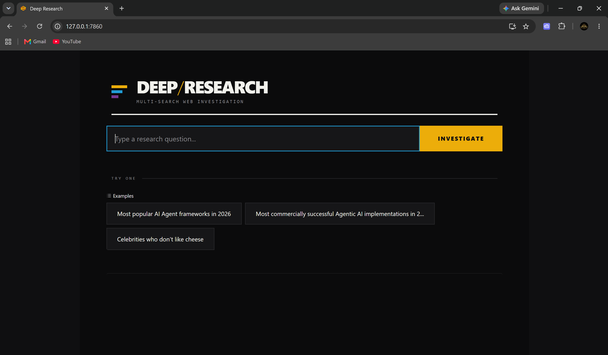

# 🔍 Autonomous Deep Research System

An AI-powered research assistant built with **Python**, **OpenAI Agents SDK**, and **Gradio** that autonomously plans research, performs parallel web searches, synthesizes findings into a structured report, and emails the final results.

---

# Overview

This project demonstrates an autonomous multi-stage research workflow where specialized AI agents collaborate to answer complex research questions.

Instead of relying on a single LLM response, the system decomposes the problem into multiple research tasks, executes searches concurrently, generates a comprehensive report, and automatically delivers the results via email.

---

## Demo



---

# Features

- Autonomous research planning
- Parallel web search execution
- AI-powered report generation
- Email delivery of research reports
- Interactive Gradio web interface
- OpenAI tracing for workflow observability
- Modular agent architecture

---

# Architecture

```
User Question
      │
      ▼
Planner Agent
      │
      ▼
Search Plan
      │
      ▼
Multiple Search Agents
      │
      ▼
Collected Results
      │
      ▼
Writer Agent
      │
      ▼
Research Report
      │
      ▼
Email Agent
      │
      ▼
Delivered Report
```

---

# Technology Stack

- Python
- OpenAI Agents SDK
- OpenAI API
- Gradio
- Pydantic
- Python Dotenv
- Requests

---

# Installation

Clone the repository

```bash
git clone https://github.com/NeelPawar-01/deep-research-agent.git
```

Move into the project

```bash
cd deep-research-agent
```

Install dependencies

```bash
pip install -r requirements.txt
```

Create a `.env` file

```env
OPENAI_API_KEY=your_api_key
```

Run the application

```bash
python app.py
```

---

# Example Workflow

1. Enter a research question.
2. The Planner Agent creates a research strategy.
3. Search Agents perform parallel information gathering.
4. The Writer Agent synthesizes the findings into a structured report.
5. The Email Agent sends the completed report.
6. The user receives both the report in the UI and via email.

---

# Skills Demonstrated

- Autonomous AI Agents
- Agent Orchestration
- Parallel Task Execution
- OpenAI Agents SDK
- LLM Workflow Design
- Research Automation
- Python Application Development
- Async Programming
- Prompt Engineering

---

# Future Improvements

- Support for local LLMs
- Retrieval-Augmented Generation (RAG)
- PDF export
- Citation management
- Multi-provider LLM support
- Persistent research history

---

# About

This project demonstrates how autonomous AI agents can collaborate to perform complex research tasks through planning, execution, synthesis, and automated report delivery.